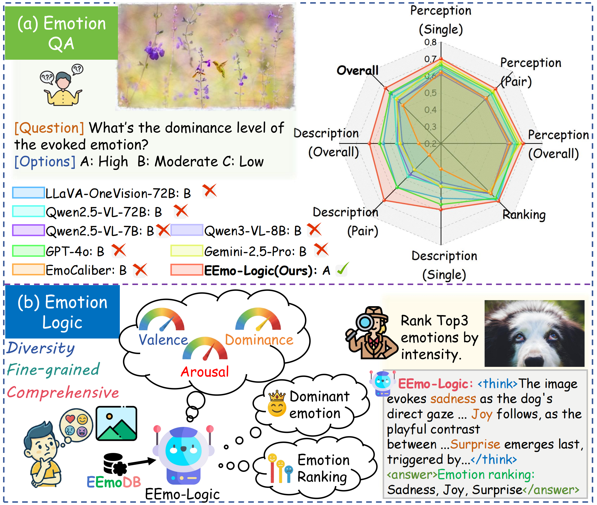

<div align="center">
<div style="width: 100%; text-align: center; margin:auto;">
      
</div>
</div>

<h1>
EEmo-Logic: A Unified Dataset and Multi-Stage Framework for Image-Evoked Emotion Assessment
</h1>


<div align="center">
<div style="width: 100%; text-align: center; margin:auto;">
      
</div>
</div>

Understanding the multi-dimensional attributes and intensity nuances of image-evoked emotions is pivotal for advancing machine empathy and empowering diverse human-computer interaction applications. However, existing models are still limited to coarse-grained emotion perception or deficient reasoning capabilities. 

To bridge this gap, we introduce **EEmoDB**, the largest image-<u>e</u>voked <u>emo</u>tion understanding <u>d</u>ataset to date. It features $5$ analysis dimensions spanning $5$ distinct task categories, facilitating comprehensive interpretation. Specifically, we compile $1.2M$ question-answering (QA) pairs (EEmoDB-QA) from $125k$ images via automated generation, alongside a $36k$ dataset (EEmoDB-Assess) curated from $25k$ images for fine-grained assessment. 

Furthermore, we propose **EEmo-Logic**, an **all-in-one** multimodal large language model (MLLM) developed via instruction fine-tuning and task-customized group relative preference optimization (GRPO) with novel reward design. Extensive experiments demonstrate that EEmo-Logic achieves robust performance in in-domain and cross-domain datasets, excelling in emotion QA and fine-grained assessment. 

## 🔍 Qualitative Results

<div align="center">
<div style="width: 100%; text-align: center; margin:auto;">
      
</div>
</div>

## 📜TODO

- [ ] Release the training script
- [ ] Release the EEmo-Logic checkpoint
- [ ] Release the EEmoDB dataset
- [x] Release the inference script

## 🛠️ Installation

```shell
# create conda environment
conda create -n eemo-logic python=3.10
conda activate eemo-logic

# install requirements
pip install -r requirements.txt
```

## 🚀 Inference

To facilitate inference, we have refined the label format for the test datasets. You can directly use the JSON files from the [test data](test_data/) folder. For the images, please download them from the open-source version of the original dataset. We conduct testing on both in-domain and cross-domain datasets. The specific procedure is as follows:

### In-Domain Datasets

Assuming you have already downloaded the [EEmo-Bench](https://github.com/workerred/EEmo-Bench) dataset, you can use the following command to obtain EEmo-Logic's responses for the **Perception**, **Ranking**, **Description**, and **Assessment** tasks.

<details>
  <summary>Inference arguments</summary>

- `model_dir` (str): Path to your downloaded **EEmo-Logic** checkpoint. 
- `json_file` (str): Path to the question-answer pair JSON files in your downloaded EEmo-Bench dataset. 
- `output_file` (str): The save path for the result JSON files.
- `image_folder` (str): Path to the images folder in your downloaded EEmo-Bench dataset. 
</details>

```shell
python inference/evaluate_perception_single.py  # Single-image emotion perception task
python inference/evaluate_perception_pair.py  # Paired-images emotion perception task
python inference/evaluate_description.py  # Emotion description task
python inference/evaluate_ranking.py  # Emotion ranking task with reasoning process
python inference/evaluate_vad.py  # VAD assessment task with reasoning process
```
### Cross-Domain Datasets
1. Dominant Emotion Classification
Once you have prepared the [Artphoto](https://www.imageemotion.org/) and [ArtEmis](https://github.com/optas/artemis) cross-domain datasets, you can use the following code to perform inference:

      <details>
      <summary>Inference arguments</summary>

      - `model_dir` (str): Path to your downloaded **EEmo-Logic** checkpoint. 
      - `root_dir` (str): Path to your dataset folder of all the downloaded files.
      - `input_json` (str): Path to the JSON file recording the dominant emotion labels for each test sample.
      - `output_json` (str): The save path for the result JSON files.
      </details>

      ```shell
      python inference/evaluate_Artphoto_think.py  # Generate Artphoto results with reasoning process
      python inference/evaluate_ArtEmis_think.py  # Generate ArtEmis results with reasoning process
      ```

2. Aesthetic Empathy Question-Answering Tasks
Once you have prepared the [AesBench AesE](https://github.com/yipoh/AesBench) and [UNIAA Sent.](https://github.com/KlingTeam/Uniaa) cross-domain benchmarks, you can use the following code to perform inference:

      <details>
      <summary>Inference arguments</summary>

      - `model_dir` (str): Path to your downloaded **EEmo-Logic** checkpoint. 
      - `image_folder` (str): Path to the images folder in your downloaded Aesthetic benchmarks' Empathy subset. 
      - `input_json` (str): Path to the question-answer pair JSON files in your downloaded Aesthetic benchmarks' Empathy subset. 
      - `output_json` (str): The save path for the result JSON files.
      </details>
      
      ```shell
      python inference/evaluate_AesBench_AesE.py  # AesBench AesE
      python inference/evaluate_ArtEmis_think.py  # UNIAA Sent.
      ```
