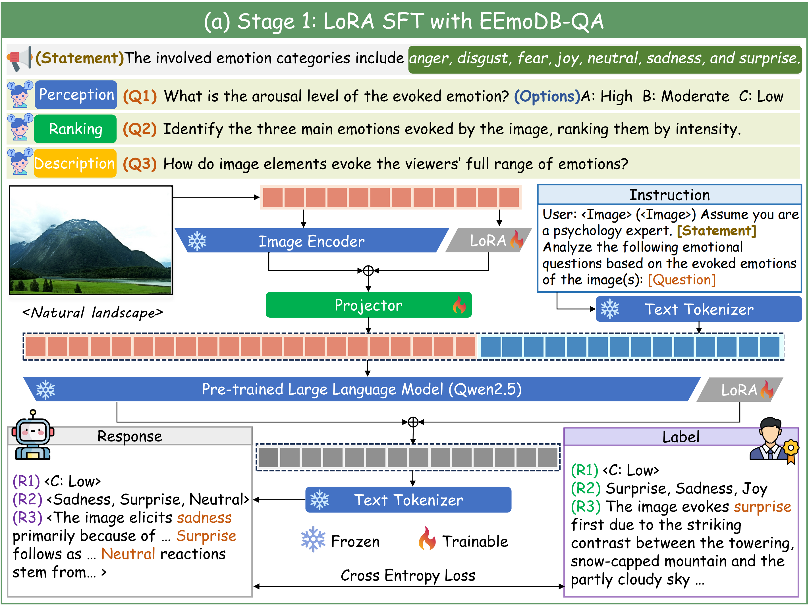

# Stage 1 — Qwen2.5-VL LoRA Fine-tuning (SFT)

This repository implements the first stage of the EEmo-Logic emotion-aware training pipeline: supervised fine-tuning (SFT) of Qwen2.5-VL using LoRA. It is based on the [Qwen2-VL-Finetune](https://github.com/2U1/Qwen2-VL-Finetune) framework, with modifications for emotion-conditioned visual understanding.

## Overview

Stage 1 performs parameter-efficient fine-tuning of Qwen2.5-VL-7B-Instruct with LoRA adapters applied to the vision tower, while keeping the LLM and merger (projector) frozen. The output is a LoRA checkpoint that serves as the initialization for Stage 2 GRPO training.

<div align="center">
<div style="width: 60%; text-align: center; margin:auto;">
      
</div>
</div>

### Pipeline

```
finetune_lora_vision.sh
  └── deepspeed src/train/train_sft.py
        ├── params.py               Parses Model/Data/Training arguments
        ├── monkey_patch_forward.py Patches forward for mixed-modality
        ├── data.py                 Loads LLaVA-format JSON via SupervisedDataset
        ├── trainer.py              QwenTrainer with LoRA + per-component LRs
        ├── train_utils.py          DeepSpeed ZeRO-3 aware checkpointing
        └── constants.py            Special token definitions

merge_lora.sh
  └── python src/merge_lora_weights.py
        └── utils.py                load_pretrained_model() → merge → save
```

## Repository Structure

```
Stage_1/
├── requirements.txt                # Python dependencies
├── environment.yaml                # Conda environment specification
├── LICENSE                         # Apache 2.0
├── .gitignore
├── scripts/
│   ├── finetune_lora_vision.sh     # Main training entry point (SFT with LoRA)
│   ├── merge_lora.sh               # Merge LoRA adapters back into base model
│   ├── zero2.json                  # DeepSpeed ZeRO-2 config
│   ├── zero2_offload.json          # DeepSpeed ZeRO-2 with CPU offload
│   ├── zero3.json                  # DeepSpeed ZeRO-3 config
│   └── zero3_offload.json          # DeepSpeed ZeRO-3 with CPU offload
└── src/
    ├── __init__.py
    ├── merge_lora_weights.py       # Standalone LoRA merge script
    ├── utils.py                    # Model loading utilities
    └── train/
        ├── __init__.py
        ├── constants.py            # Special tokens and system message
        ├── data.py                 # LLaVA-format dataset pipeline
        ├── monkey_patch_forward.py # Mixed-modality forward patches
        ├── params.py               # Model/Data/Training argument dataclasses
        ├── train_sft.py            # Core SFT training orchestration
        ├── train_utils.py          # DeepSpeed-aware checkpointing
        └── trainer.py              # QwenTrainer (per-component LRs)
```

## Installation

### Using `requirements.txt`

```bash
pip install -r requirements.txt
```

### Using `environment.yaml`

```bash
conda env create -f environment.yaml
conda activate train
```


## Training

### Update Paths

Before training, update the following paths in `scripts/finetune_lora_vision.sh`:

| Variable | Description |
|----------|-------------|
| `MODEL_NAME` | HuggingFace model ID or local path |
| `--data_path` | Path to your training data JSON file |
| `--image_folder` | Path to the folder containing your images |
| `--output_dir` | Path where checkpoints will be saved |

### Launch Training

```bash
bash scripts/finetune_lora_vision.sh
```

This launches multi-GPU distributed training with DeepSpeed Zero3. By default, the vision tower is trained with LoRA while the LLM and merger are frozen.

## Merging LoRA Weights

After training, merge the LoRA adapter weights back into the base model.

### Update Paths

Update the following paths in `scripts/merge_lora.sh`:

| Variable | Description |
|----------|-------------|
| `MODEL_NAME` | HuggingFace model ID or local path of the base model |
| `--model-path` | Path to your LoRA checkpoint directory |
| `--save-model-path` | Path where the merged model will be saved |

### Run Merge

```bash
bash scripts/merge_lora.sh
```

## Training Arguments

Key arguments available in `src/train/params.py`:

| Argument | Description | Default |
|----------|-------------|---------|
| `--deepspeed` | Path to DeepSpeed config file | `scripts/zero3.json` |
| `--data_path` | Path to LLaVA-formatted training data (JSON file) | **(Required)** |
| `--image_folder` | Path to the images folder | **(Required)** |
| `--model_id` | Path or HuggingFace ID of the model | `Qwen/Qwen2.5-VL-7B-Instruct` |
| `--use_liger` | Use liger kernel for memory-efficient fused CE loss | `True` |
| `--output_dir` | Output directory for model checkpoints | |
| `--num_train_epochs` | Number of training epochs | `1` |
| `--per_device_train_batch_size` | Training batch size per GPU | |
| `--gradient_accumulation_steps` | Gradient accumulation steps | |
| `--freeze_vision_tower` | Freeze vision model | `False` |
| `--freeze_llm` | Freeze LLM | `False` |
| `--freeze_merger` | Freeze projector | `False` |
| `--lora_enable` | Use LoRA | `False` |
| `--vision_lora` | Include vision tower in LoRA (requires `--lora_enable`) | `False` |
| `--use_dora` | Use DoRA instead of LoRA | `False` |
| `--lora_rank` | LoRA rank | `64` |
| `--lora_alpha` | LoRA alpha | `16` |
| `--lora_dropout` | LoRA dropout | `0.05` |
| `--lora_namespan_exclude` | Module namespans to exclude from LoRA | |
| `--num_lora_modules` | Number of target modules for LoRA (-1 = all) | `-1` |
| `--vision_lr` | Learning rate for vision model | |
| `--merger_lr` | Learning rate for merger/projector | |
| `--learning_rate` | Learning rate for language module | |
| `--max_seq_length` | Maximum sequence length | `32768` |
| `--bits` | Quantization bits | `16` |
| `--disable_flash_attn2` | Disable Flash Attention 2 | `False` |
| `--bf16` | Use bfloat16 | `False` |
| `--fp16` | Use fp16 | `False` |
| `--image_min_pixels` | Min input tokens for image | `3136` |
| `--image_max_pixels` | Max input tokens for image | `12845056` |
| `--video_min_pixels` | Min input tokens for video | `100352` |
| `--video_max_pixels` | Max input tokens for video | `602112` |
| `--dataloader_num_workers` | Number of data loader workers | `4` |

## Reference

This work is based on the [Qwen2-VL-Finetune](https://github.com/2U1/Qwen2-VL-Finetune) framework:

> **Qwen2-VL-Finetune**
> [Code](https://github.com/2U1/Qwen2-VL-Finetune)

## Citation

If you find this project useful in your research, please consider citing both EEmo-Logic and Qwen2-VL-Finetune:

```BibTeX
@article{gao2026eemo,
  title={EEmo-Logic: A Unified Dataset and Multi-Stage Framework for Comprehensive Image-Evoked Emotion Assessment},
  author={Gao, Lancheng and Jia, Ziheng and Xing, Zixuan and Sun, Wei and Duan, Huiyu and Zhai, Guangtao and Min, Xiongkuo},
  journal={arXiv preprint arXiv:2602.01173},
  year={2026}
}

@misc{Qwen2-VL-Finetuning,
  author = {Yuwon Lee},
  title = {Qwen2-VL-Finetune},
  year = {2024},
  publisher = {GitHub},
  url = {https://github.com/2U1/Qwen2-VL-Finetune}
}
```

## License

This project is licensed under the Apache-2.0 License. See [LICENSE](LICENSE) for details.

For any inquiries regarding this work, please contact us at gaolancheng@sjtu.edu.cn.
