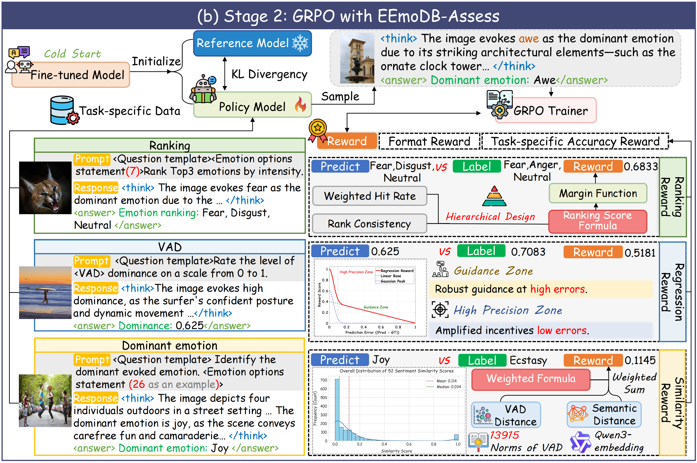

# Stage 2 — Emotion-Aware GRPO Training

This repository implements an emotion-aware Group Relative Policy Optimization (GRPO) training system based on the [VideoChat-R1](https://github.com/OpenGVLab/VideoChat-R1) framework. It fine-tunes first stage model to better understand human emotions in video content, using VAD (Valence-Arousal-Dominance) distances and embedding similarity to construct fine-grained reward matrices.

## Overview

The core idea is to replace standard binary reward (correct/wrong) with a matrix-based reward that captures the semantic relationships between emotion categories. For example, predicting "Contentment" when the ground truth is "Joy" receives a partial reward, while predicting "Disgust" when the correct answer is "Joy" receives a harsh penalty.

<div align="center">
<div style="width: 60%; text-align: center; margin:auto;">
      
</div>
</div>

### Pipeline

```
VAD Scores (emotion_vad_scores.json)
    └── vad_distance.py ──► vad_distance.json
                                        └── dominant_reward_dict.py ──► reward_matrix_1.json ──► GRPO Reward
Embedding Model (Qwen3-Embedding)
    └── save_embedding.py ──► check_embedding.json
```

## Repository Structure

```
Stage_2/
├── finetune_grpo.sh               # Main training entry point
├── src/open_r1/
│   ├── grpo_emotion.py            # Emotion GRPO training script
│   ├── my_qwen_utils.py           # Vision processing utilities
│   └── trainer/
│       ├── grpo_trainer_video_qa.py   # QA/Emotion GRPO trainer
│       ├── vllm_grpo_trainer_video_tg.py  # vLLM GRPO trainer
│       └── __init__.py
├── training_scripts/
│   ├── zero2.json                 # DeepSpeed ZeRO-2 config
│   ├── zero3.json                 # DeepSpeed ZeRO-3 config
│   └── zero3_offload.json         # DeepSpeed ZeRO-3 with CPU offload
├── modeling_qwen2_5_vl.py         # Custom Qwen2.5-VL model
├── modeling_qwen2_5_vl_vllm.py    # vLLM variant of custom model
├── processing_qwen2_5_vl.py       # Custom Qwen2.5-VL processor
├── dominant_reward_dict.py        # Generate reward_matrix_1.json
├── save_embedding.py              # Generate check_embedding.json
├── vad_distance.py                # Generate vad_distance.json
├── thinking_consistancy.py        # Evaluate thinking consistency
├── watchdog.py                    # Process monitor utility
├── reward_matrix_1.json           # Final reward matrix
├── check_embedding.json           # Embedding similarity data
├── emotion_vad_scores.json        # VAD scores for emotion categories
├── vad_distance.json              # VAD distance matrix
├── setup.py                       # Package installer
└── requirements.txt               # Python dependencies
```

## Installation

```bash
pip install -r requirements.txt
pip install -e .
```


## Training

### Update Paths

Before training, update the following paths in `finetune_grpo.sh`:

| Variable | Description |
|----------|-------------|
| `MODEL_NAME` | Path to your pretrained/checkpoint model |
| `OUTDIR` | Output directory for training artifacts |
| `--train_data_path` | Path to training JSON file |
| `--eval_data_path` | Path to evaluation JSON file |
| `--video_folder` | Directory containing video/image files |

### Launch Training

```bash
bash finetune_grpo.sh
```

This launches multi-GPU distributed training with DeepSpeed ZeRO-3 optimization.

### Training Arguments

Key arguments in `finetune_grpo.sh`:

| Argument | Description |
|----------|-------------|
| `--model_name_or_path` | Pretrained model path |
| `--train_data_path` | Training data JSON file |
| `--eval_data_path` | Evaluation data JSON file |
| `--video_folder` | Video/image directory |
| `--num_generations` | Number of completions per prompt |
| `--learning_rate` | Learning rate |
| `--per_device_train_batch_size` | Batch size per device |
| `--gradient_accumulation_steps` | Gradient accumulation steps |
| `--num_train_epochs` | Number of training epochs |
| `--max_completion_length` | Maximum generation length |
| `--max_prompt_length` | Maximum prompt length |
| `--temperature` | Sampling temperature |
| `--deepspeed` | DeepSpeed config file |

## Evaluation (Thinking Consistency)

Run `thinking_consistancy.py` to evaluate whether the model's reasoning in `<think>` tags is consistent with its final emotion predictions:

```bash
python thinking_consistancy.py
```

Update the model path and benchmark JSON path inside the script before running.

## Process Monitoring

Use `watchdog.py` to automatically restart training if it crashes:

```bash
# Edit sh_script_path in watchdog.py first
python watchdog.py
```

## Reference

This work is based on the [VideoChat-R1](https://github.com/OpenGVLab/VideoChat-R1) framework:

> **VideoChat-R1: Enhancing Spatio-Temporal Perception via Reinforcement Fine-Tuning**
> [Paper](https://arxiv.org/abs/2504.06958) | [Code](https://github.com/OpenGVLab/VideoChat-R1)


## Citation

If you find this project useful in your research, please consider cite both VideoChat-R1 and our work:

```BibTeX
@article{gao2026eemo,
  title={EEmo-Logic: A Unified Dataset and Multi-Stage Framework for Comprehensive Image-Evoked Emotion Assessment},
  author={Gao, Lancheng and Jia, Ziheng and Xing, Zixuan and Sun, Wei and Duan, Huiyu and Zhai, Guangtao and Min, Xiongkuo},
  journal={arXiv preprint arXiv:2602.01173},
  year={2026}
}

@article{li2025videochatr1,
  title={VideoChat-R1: Enhancing Spatio-Temporal Perception via Reinforcement Fine-Tuning},
  author={Li, Xinhao and Yan, Ziang and Meng, Desen and Dong, Lu and Zeng, Xiangyu and He, Yinan and Wang, Yali and Qiao, Yu and Wang, Yi and Wang, Limin},
  journal={arXiv preprint arXiv:2504.06958},
  year={2025}
}
```

For any inquiries regarding this work, please contact us at gaolancheng@sjtu.edu.cn.
